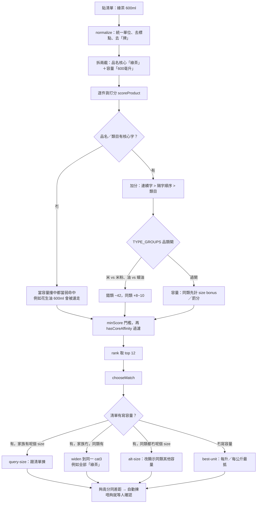

# 格價籃 HK-Cart

香港超市格價 web app：貼一張 shopping list（品牌型號或模糊關鍵字），用消費者委員會「[格價資訊通](https://online-price-watch.consumer.org.hk/opw/)」對價，再分組話你知邊度最平。

- 一間買晒 / 逐件最平 / 分兩間買
- 容量、買 2 件優惠、自己填價錢
- 消委會冇貨可以再搜 HKTVmall／惠康／Price.com.hk

Demo: [即時試：（https://hk-cart.grok.me）]

開源：[github.com/rayony/HK-Cart](https://github.com/rayony/HK-Cart)

## 本機

```bash
npm install
npm run dev
```

開 `http://localhost:8080`。第一次會下載消委會貨品庫，載入完先可以格價。

可選環境變數見 `.env.example`。`XAI_API_KEY` 只係自動配對唔到先會用。

HKTVmall 即時搜尋用嘅 Algolia 係網站公開嘅 search-only key，唔係我哋嘅帳號密鑰。

## 資料來源

價格同優惠來自消費者委員會開放數據，實際以店舖為準。

---

## 模糊搜尋點樣做

核心喺 [`src/lib/opw/match.ts`](src/lib/opw/match.ts)，容量／家族喺 [`src/lib/opw/pack.ts`](src/lib/opw/pack.ts)。唔用向量 embedding：對住消委會 ~2,600 件貨逐件打分（0–100），再揀自動預設款。

香港超市清單好短、好口語（「金象米」「綠茶 600ml」「米」），同貨品全名差好遠。所以優先 **字順序**、**品類**，容量只係修飾。



### 1. 先正規化

| 步驟 | 例子 |
| --- | --- |
| Unicode NFKC | 全形數字 → 半形 |
| 單位統一 | `600ml` → `600毫升`，`5kg` → `5公斤` |
| 去標點、空白壓縮 | `金象牌・香米` → `金象牌 香米` |
| 去填充字 | `金象牌` → `金象`（「牌／的／之」） |
| **品名同容量拆開** | `綠茶 600ml` → 核心 `綠茶` + size `600毫升` |

容量唔好混入中文字串：否則 `綠茶毫升` 會同任何「毫升」貨（花生油、佳得樂）撞字。

### 2. 打分（品名先於容量）

由高到低：

1. **完全相等** → 100 / 96
2. **連續子字串**（`綠茶` ⊂ `蜂蜜綠茶`）→ +52
3. **隔字但順序啱**（`金象米` ⊂ `金象牌頂上茉莉香米`）→ `orderedSpan`，字愈密分愈高
4. **品牌開頭**（清單以品牌起）再對剩餘字
5. **類目**（消委會 cat3，例如「綠茶」）
6. **CJK bigram Dice** 同英文 token
7. **容量**：只當品名已經命中先加／減。同類唔中 size 只 −8；唔同類就算 600ml 都幾乎 0 分
8. **修飾／口味**：「零系／檸檬／無糖」貨有、清單冇 → 罰；「梳打 vs 忌廉」錯配重罰
9. **TYPE_GROUPS** 見下一節

最後 clip 到 0–100。低於門檻（單字 22、其他 16）唔入榜。

### 3. 品類閘：分開「米」同「米粉」

短字係另一件貨嘅詞幹。最長 key 優先（`米粉` 贏 `米`）：

| 清單 | 當呢類 | 排除 |
| --- | --- | --- |
| 米 | 香米／白米／絲苗 | 米粉、米線、米餅、粘米粉、玉米 |
| 米粉／米線 | 炒米粉、河粉 | 香米、粘米粉 |
| 油 | 花生油、菜油 | 蠔油、醬油、麻油、活絡油 |
| 奶 | 鮮奶、牛奶 | 奶粉、豆奶、煉奶 |
| 麵 | 即食麵、拉麵 | 麵包、麵粉 |
| 綠茶／紅茶 | 茶類、檸檬茶 | 洗手梘、茶包 |

錯類 −42，所以「米」唔會出「銀絲米粉」。

### 4. 容量：同類先，唔好用 volume 推第二件貨

`綠茶 600ml` 喺消委會其實冇 600ml 綠茶（有 500 / 550 / 1.5L）。

- `hasCoreAffinity`：有「綠茶」呢截先留；600ml 花生油／佳得樂濾走
- `chooseMatch` 先喺同一家族搵 size；冇就 widen 到 **同一個 cat3**（全部綠茶）
- 仍然冇 → `alt-size`：「冇你寫嘅容量，改顯示同類」
- 清單冇寫容量 → 預設 **每升／每公斤最抵**（`best-unit`），唔係最平件價

數字 token 有邊界：`5公斤` 唔當 `15公斤` 一部分。

### 5. 幾時自動揀、幾時等人確認

| 情況 | 行為 |
| --- | --- |
| 分數 ≥ 78，或者 ≥ 58 同第二名差 ≥ 8 | 自動揀 |
| 頭兩名同一家族、分差細 | 唔自動，出容量掣等人揀 |
| 有寫容量、家族對到 | 跟清單 size |
| 有寫容量、對唔到 | 改顯示同類其他 size，並標明 |
| 仍然唔肯定／0 命中 | 確認區：改關鍵字、跳過、搜其他來源 |

自動揀唔到先會用可選嘅 Grok（`XAI_API_KEY`），只喺本地 candidate 裏面揀，唔會憑空發明貨品。

### 例子

| 清單 | 點解會出呢啲 |
| --- | --- |
| `金象米` | `orderedSpan`：金→象→米 順序喺「金象牌頂上茉莉香米」 |
| `米` | TYPE_GROUPS 排除米粉／米餅 |
| `綠茶 600ml` | 核心「綠茶」；冇 600ml 就出 500ml／550ml 綠茶，唔出 600ml 油 |
| `可口可樂 1L` vs `500ml` | 跟你寫嘅容量；冇寫就每升最抵 |
| `玉泉梳打水`（消委會冇） | 確認 → 搜 HKTVmall／惠康／Price.com.hk，或者自己填價 |
